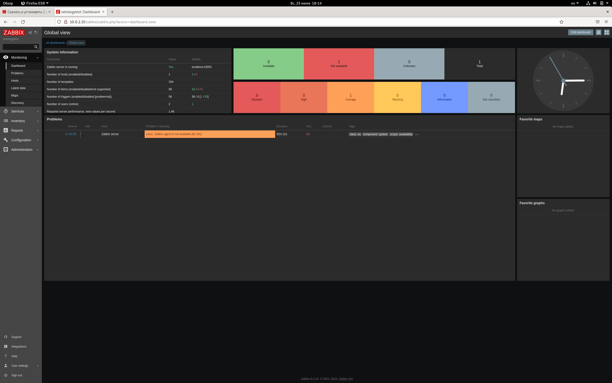
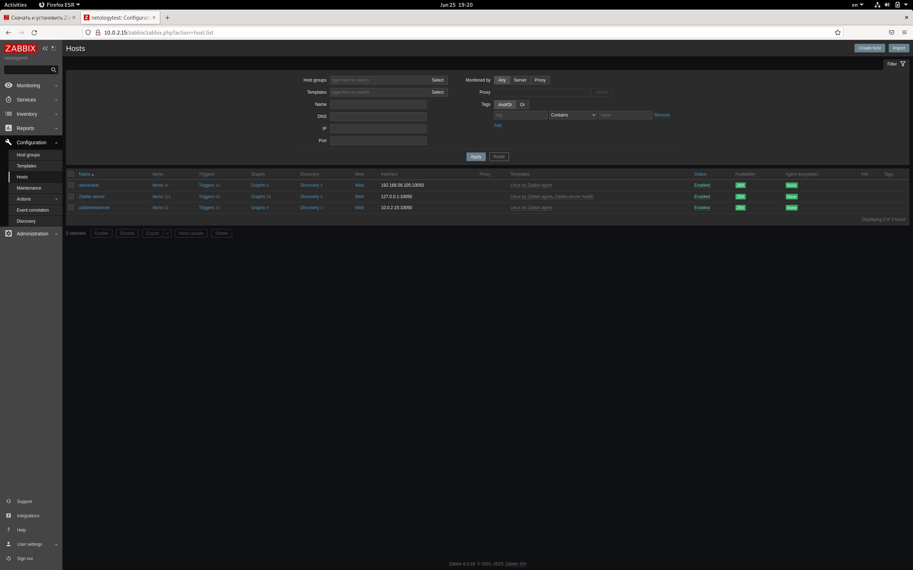
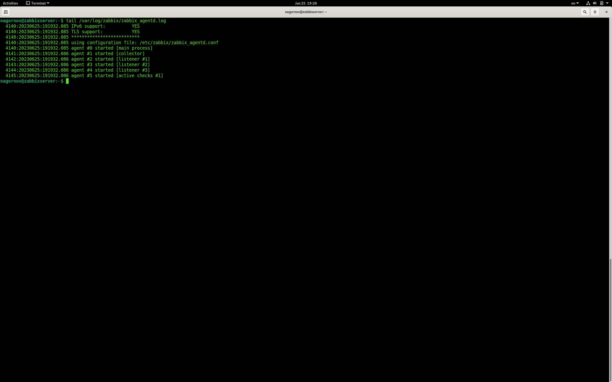
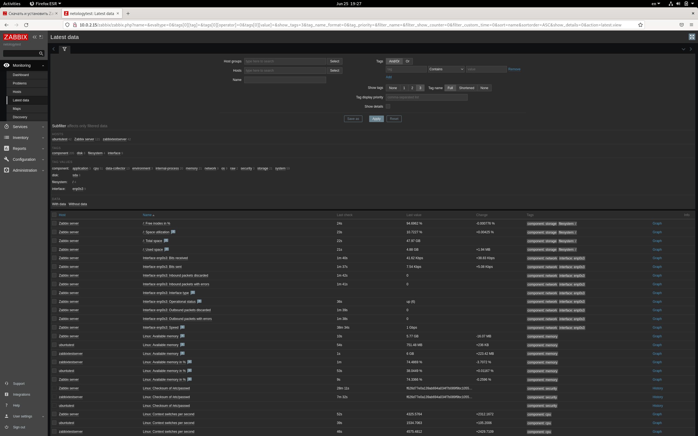

# Домашнее задание к занятию "Система мониторинга Zabbix" - `Нагорнов Антон Алексеевич`

### Задание 1

apt install postgresql
wget https://repo.zabbix.com/zabbix/6.0/debian/pool/main/z/zabbix-release/zabbix-release_6.0-4+debian11_all.deb
dpkg -i zabbix-release_6.0-4+debian11_all.deb
apt update
apt install zabbix-server-pgsql zabbix-frontend-php php7.4-pgsql zabbix-apache-conf zabbix-sql-scripts
sudo -u postgres createuser --pwprompt zabbix
sudo -u postgres createdb -O zabbix zabbix 
zcat /usr/share/zabbix-sql-scripts/postgresql/server.sql.gz | sudo -u zabbix psql zabbix 
nano /etc/zabbix/zabbix_server.conf
systemctl restart zabbix-server apache2
systemctl enable zabbix-server apache2

1. 

### Задание 2
sudo apt install zabbix-aget
sudo nano /etc/zabbix/zabbix_agentd.conf (редактирую Server=)
1. 

tail /var/log/zabbix/zabbix_agentd.log 
2. 

3. 
